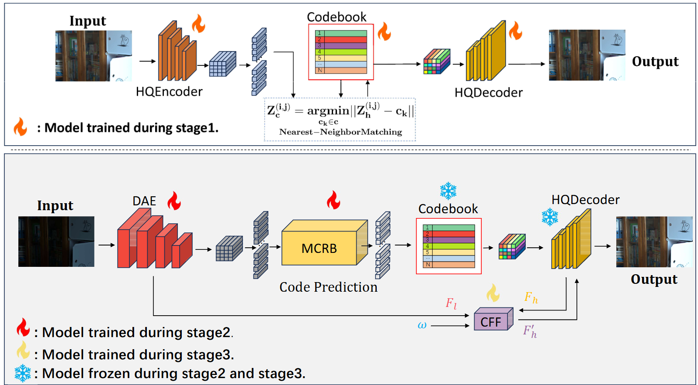

# [WACV 2026]:sparkles:Official Complement of CodeMTNet.



# Environment 
First, you need to execute the following command in terminal:

```bash
conda create -n codemtnet python=3.9    
conda activate codemtnet
conda install cudatoolkit==11.7 -c nvidia
conda install pytorch==1.13.1 torchvision==0.14.1 torchaudio==0.13.1 pytorch-cuda=11.7 -c pytorch -c nvidia
pip install transformers==4.50.0 --force-reinstall
conda install -c "nvidia/label/cuda-11.7.0" cuda-nvcc
conda install packaging
wget https://bgithub.xyz/Dao-AILab/causal-conv1d/releases/download/v1.0.0/causal_conv1d-1.0.0+cu118torch1.13cxx11abiFALSE-cp39-cp39-linux_x86_64.whl
pip install ./causal_conv1d-1.0.0+cu118torch1.13cxx11abiFALSE-cp39-cp39-linux_x86_64.whl
wget https://bgithub.xyz/state-spaces/mamba/releases/download/v1.0.1/mamba_ssm-1.0.1+cu118torch1.13cxx11abiFALSE-cp39-cp39-linux_x86_64.whl
pip install ./mamba_ssm-1.0.1+cu118torch1.13cxx11abiFALSE-cp39-cp39-linux_x86_64.whl
pip install numpy==1.23.5 --force-reinstall
pip install opencv-python, lpips, pynvml
```

Then you can use this command to test a photo:
```bash
cd CodeMTNet
bash run.sh
```
# Pretraining Model
Weights of model training on LOLv1, LOLv2 real and LOLv2 synthetic can be downloaded from the following links:
- LOLv1: https://pan.baidu.com/s/1ayC7URQs0tHj6wFpnTF4fw?pwd=5y65
- LOLv2 real: https://pan.baidu.com/s/1gpLDQ-V_iOZnRQJffO0Ijg?pwd=wuzq
- LOLv2 synthetic: https://pan.baidu.com/s/13rdE1_59Q3OeD96sQpDp3w?pwd=nsgi

You need to create a folder named 'experiments' in the CodeMTNet folder. Then weight of LOLv1 need to be placed in experiments/LOLv1, weight of LOLv2 real need to be placed in experiments/LOLv2real, and weight of LOLv2 synthetic need to be placed in experiments/LOLv2syn.

# Datasets
The LOLv1, LOLv2 real, and LOLv2 synthetic datasets can be placed separately in the root directory of CodeMTNet.


